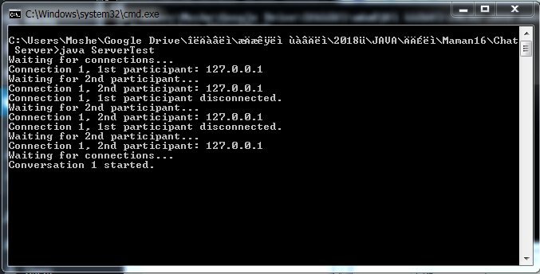
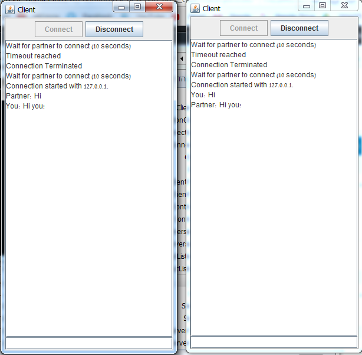
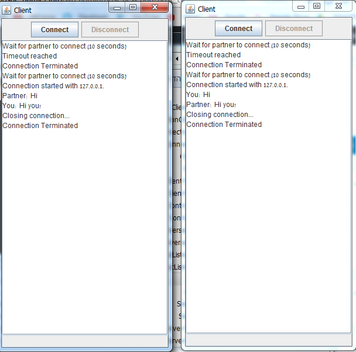

# JavaChat

Simple chat server and client.  
The server connects every 2 clients connected to him to speak together. Support multiple chat sessions.  

## Highlights:
* Java
* Java GUI
* Java Networking

## Screenshots:  
* Server  
	  
* Client Connected  
	  
* Client Disconnected  
	  